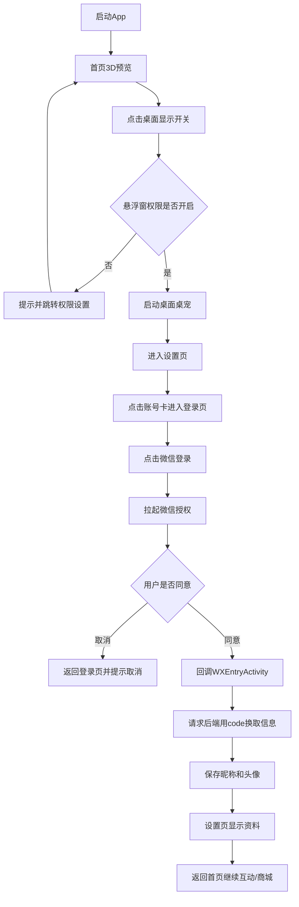

# 微信审核流程图（文本版，可粘贴到 ProcessOn / draw.io）

## 流程节点

1. 启动 App  
2. 进入首页，展示 3D 模型预览  
3. 用户点击“在桌面显示桌宠”开关  
4. 判断是否具备悬浮窗权限  
   - 否：提示并跳转系统权限页 -> 用户返回首页  
   - 是：启动桌面桌宠展示  
5. 用户进入设置页  
6. 用户点击账号信息卡片，进入登录页  
7. 用户点击“微信登录”  
8. App 拉起微信授权页面  
9. 用户在微信内选择  
   - 同意授权：微信回调到 `WXEntryActivity`  
   - 取消授权：回到登录页并提示“已取消登录”  
10. App 使用授权 `code` 请求后端接口  
11. 后端向微信换取用户信息（昵称、头像URL）  
12. App 保存昵称和头像到本地（SharedPreferences）  
13. 返回设置页，展示用户昵称和头像  
14. 用户返回首页，继续进行互动与商城使用

## 信息说明（建议写在流程图旁）

- 获取信息：昵称、头像 URL  
- 使用目的：仅用于设置页个人资料展示  
- 存储方式：本地存储（SharedPreferences），后端仅用于授权换取信息  
- 不涉及能力：微信支付、分享、朋友圈

## Mermaid 版本（可选）

